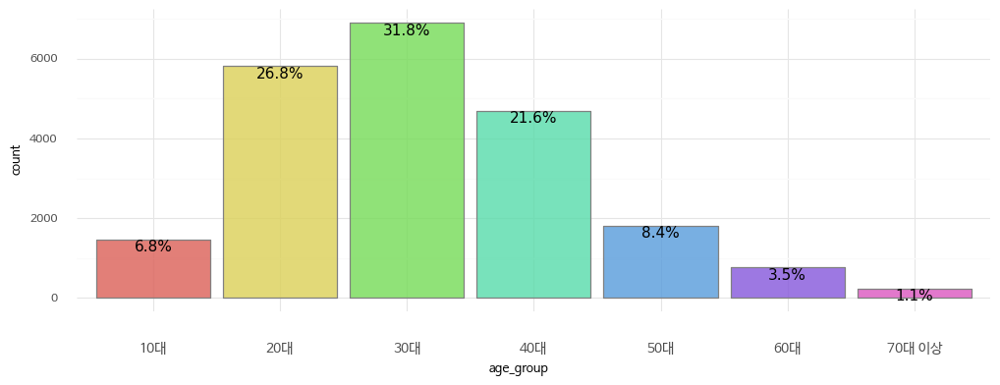
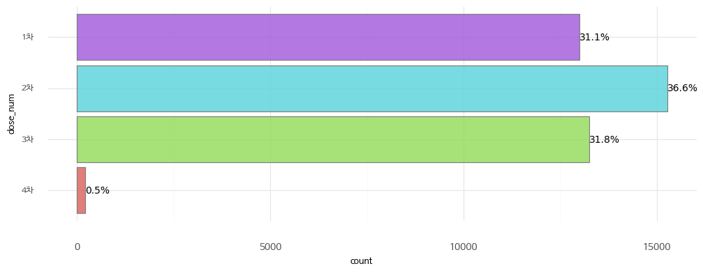
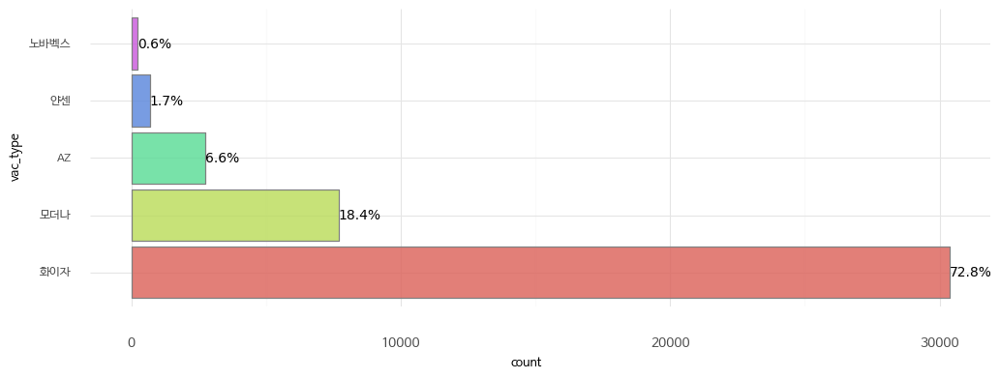
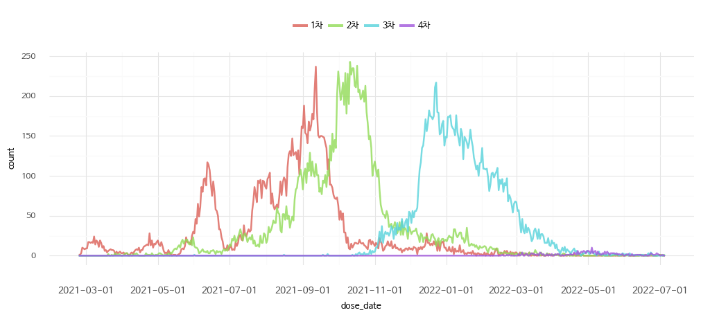

### 데이터 건수

21,693행과 39개의 컬럼을 갖고 있으며, 컬럼은 아래 3개 유형의 정보를 담고 있습니다.

* 00정보
| 컬럼명 | 이름 | 내용 |
|-------|-----|-----|
| 예시1 | 홍길동 | 내용1 |
| 예시2 | 이순신 | 내용2 |

* 00정보
| 컬럼명 | 이름 | 내용 |
|-------|-----|-----|
| 예시1 | 홍길동 | 내용1 |
| 예시2 | 이순신 | 내용2 |

* 00정보
| 컬럼명 | 이름 | 내용 |
|-------|-----|-----|
| 예시1 | 홍길동 | 내용1 |
| 예시2 | 이순신 | 내용2 |


### 기초 정보 분포


```python
# 성별 분포
df_plot = df['gender'].value_counts().to_frame().reset_index()
df_plot.columns = ['gender', 'count']
df_plot['prop'] = df_plot['count'] / df_plot['count'].sum()
df_plot['prop'] = df_plot['prop'].apply(lambda x: f"{x:.1%}")

(
    ggplot(df_plot, aes(x='gender', y='count', fill="gender")) + 
    geom_col(aes(label='prop'), stat='identity', color="grey", alpha=0.8) + 
    geom_text(aes(label='prop'), color='black', size=12, ha='right') + 
    coord_flip() + 
    scale_fill_manual(values=['royalblue', 'orange']) + 
    themes.theme_minimal() + 
    theme(text=element_text(fontproperties=font), figure_size=(12, 4), axis_text_x=element_text(margin={'t': 10}), 
                   legend_position='top', legend_direction='horizontal', legend_title=element_blank())
)
```


    

    


    <ggplot: (8788628576455)>


```python
# 연령대 분포
df_plot = df['age_group'].value_counts().to_frame().reset_index()
df_plot.columns = ['age_group', 'count']
df_plot['age_group'] = pd.Categorical(df_plot['age_group'].map(lambda x: f'{x}대 이상' if x == 70 else f'{x}대'))
df_plot['prop'] = df_plot['count'] / df_plot['count'].sum()
df_plot['prop'] = df_plot['prop'].apply(lambda x: f"{x:.1%}")

(
    ggplot(df_plot, aes(x='age_group', y='count', fill="age_group")) + 
    geom_col(aes(label='prop'), stat='identity', color="grey", alpha=0.8) + 
    geom_text(aes(label='prop'), color='black', size=11, ha='center', va='top') + 
    themes.theme_minimal() + 
    theme(text=element_text(fontproperties=font), figure_size=(12, 4), axis_text_x=element_text(margin={'t': 10}, size=10), 
                   legend_position='none', legend_direction='horizontal', legend_title=element_blank())
)
```


    

    


    <ggplot: (8788628001031)>


```python
# 백신접종 차수 분포
cols = [x for x in df.columns if x.endswith('date')]
df_plot = pd.melt(df[cols])
df_plot = df_plot[df_plot['value'] != '-']
df_plot.columns = ['dose_num', 'count']
df_plot = df_plot.groupby('dose_num', as_index=False)['count'].count()
df_plot['dose_num'] = df_plot['dose_num'].map(lambda x: x.replace('dose_', '').replace('_date', '차'))
df_plot['dose_num'] = pd.Categorical(df_plot['dose_num'], categories=[f'{x}차' for x in range(4, 0, -1)])
df_plot['prop'] = df_plot['count'] / df_plot['count'].sum()
df_plot['prop'] = df_plot['prop'].apply(lambda x: f"{x:.1%}")

(
    ggplot(df_plot, aes(x='dose_num', y='count', fill="dose_num")) + 
    geom_col(aes(label='prop'), stat='identity', color="grey", alpha=0.8) + 
    coord_flip() + 
    geom_text(aes(label='prop'), color='black', size=10, ha='left') + 
    themes.theme_minimal() + 
    theme(text=element_text(fontproperties=font), figure_size=(12, 4), axis_text_x=element_text(margin={'t': 10}, size=10), 
                   legend_position='none', legend_direction='horizontal', legend_title=element_blank())
)
```


    

    


    <ggplot: (8788629053507)>


```python
# 백신종류 분포

cols = [x for x in df.columns if x.endswith('type')]
df_plot = pd.melt(df[cols])
df_plot = df_plot[df_plot['value'] != '-']
df_plot.columns = ['count', 'vac_type']
df_plot = df_plot.groupby('vac_type', as_index=False).count()
df_plot['prop'] = df_plot['count'] / df_plot['count'].sum()
df_plot['prop'] = df_plot['prop'].apply(lambda x: f"{x:.1%}")
df_plot['vac_type'] = pd.Categorical(df_plot['vac_type'], categories=['화이자', '모더나', 'AZ', '얀센', '노바벡스'])
display(df_plot)

(
    ggplot(df_plot, aes(x='vac_type', y='count', fill="vac_type")) + 
    geom_col(aes(label='prop'), stat='identity', color="grey", alpha=0.8) + 
    coord_flip() + 
    geom_text(aes(label='prop'), color='black', size=10, ha='left') + 
    themes.theme_minimal() + 
    theme(text=element_text(fontproperties=font), figure_size=(12, 4), axis_text_x=element_text(margin={'t': 10}, size=10), 
                   legend_position='none', legend_direction='horizontal', legend_title=element_blank())
)
```


<div>
<style scoped>
    .dataframe tbody tr th:only-of-type {
        vertical-align: middle;
    }

    .dataframe tbody tr th {
        vertical-align: top;
    }

    .dataframe thead th {
        text-align: right;
    }
</style>
<table border="1" class="dataframe">
  <thead>
    <tr style="text-align: right;">
      <th></th>
      <th>vac_type</th>
      <th>count</th>
      <th>prop</th>
    </tr>
  </thead>
  <tbody>
    <tr>
      <th>0</th>
      <td>AZ</td>
      <td>2757</td>
      <td>6.6%</td>
    </tr>
    <tr>
      <th>1</th>
      <td>노바벡스</td>
      <td>231</td>
      <td>0.6%</td>
    </tr>
    <tr>
      <th>2</th>
      <td>모더나</td>
      <td>7685</td>
      <td>18.4%</td>
    </tr>
    <tr>
      <th>3</th>
      <td>얀센</td>
      <td>694</td>
      <td>1.7%</td>
    </tr>
    <tr>
      <th>4</th>
      <td>화이자</td>
      <td>30374</td>
      <td>72.8%</td>
    </tr>
  </tbody>
</table>
</div>


    

    


    <ggplot: (8788628983426)>


```python
# 접종 시계열 분포
cols = [x for x in df.columns if x.endswith('date')]
df_plot = df[cols]
for col in cols:
    df_plot.loc[:, col] = df_plot[col].map(lambda x: None if x == '-' else x)
    df_plot.loc[:, col] = pd.to_datetime(df_plot[col])

df_plot = pd.melt(df_plot[cols])
df_plot.columns = ['dose_num', 'dose_date']
df_plot['dose_num'] = df_plot['dose_num'].map(lambda x: x.replace('dose_', '').replace('_date', '차'))
df_plot['dose_num'] = pd.Categorical(df_plot['dose_num'], categories=[f'{x}차' for x in range(1, 5)])
df_plot.loc[:, 'count'] = 1
df_plot = df_plot.groupby(['dose_date', 'dose_num'], as_index=False)['count'].count()
df_plot

(
    ggplot(df_plot, aes(x='dose_date', y='count', color="dose_num")) + 
    geom_line(alpha=0.8, size=1) + 
    themes.theme_minimal() + 
    theme(text=element_text(fontproperties=font), figure_size=(12, 4), axis_text_x=element_text(margin={'t': 10}, size=10), 
                   legend_position='top', legend_direction='horizontal', legend_title=element_blank())
)
```

    /usr/local/lib/python3.8/dist-packages/pandas/core/indexing.py:1951: SettingWithCopyWarning: 
    A value is trying to be set on a copy of a slice from a DataFrame.
    Try using .loc[row_indexer,col_indexer] = value instead
    
    See the caveats in the documentation: https://pandas.pydata.org/pandas-docs/stable/user_guide/indexing.html#returning-a-view-versus-a-copy
    /usr/local/lib/python3.8/dist-packages/pandas/core/indexing.py:1773: SettingWithCopyWarning: 
    A value is trying to be set on a copy of a slice from a DataFrame.
    Try using .loc[row_indexer,col_indexer] = value instead
    
    See the caveats in the documentation: https://pandas.pydata.org/pandas-docs/stable/user_guide/indexing.html#returning-a-view-versus-a-copy


    

    


    <ggplot: (8788628472968)>


```python
# 이상반응 분포

```
