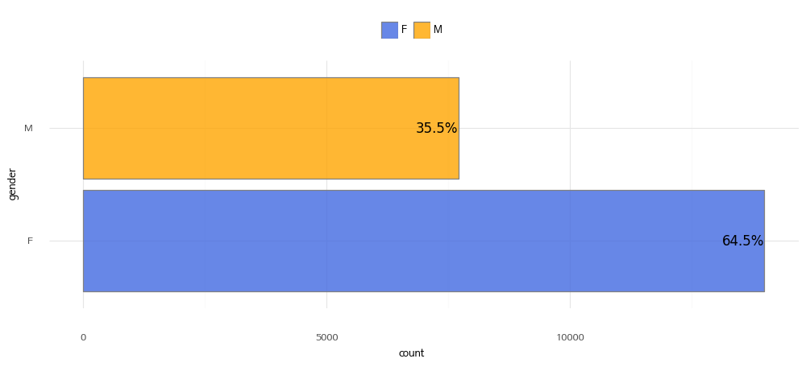
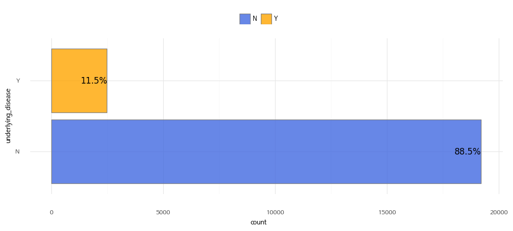
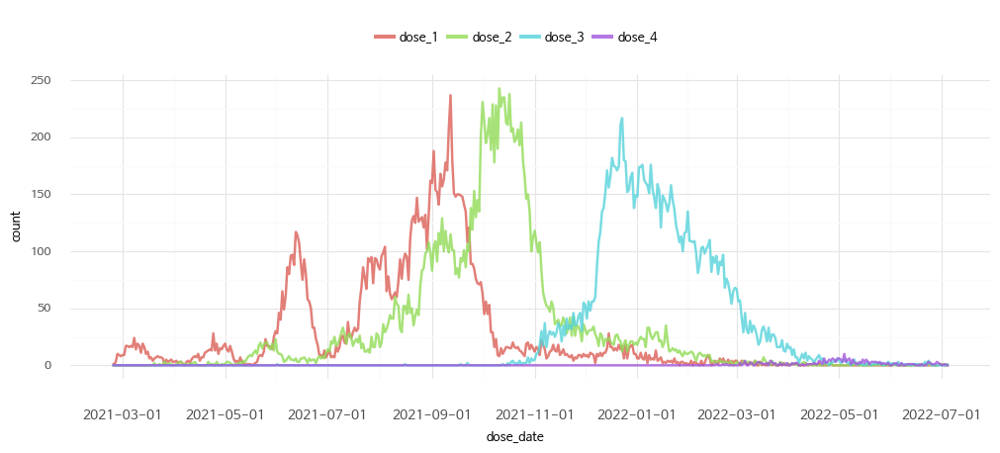
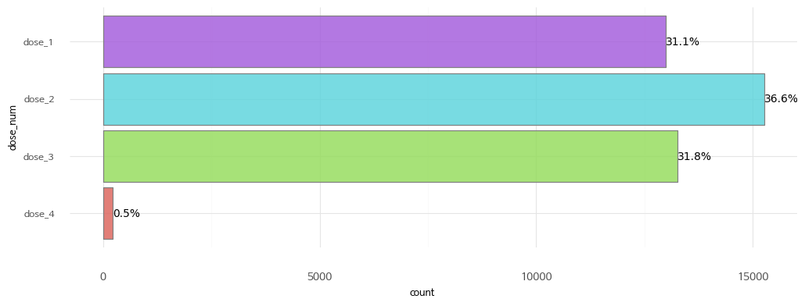
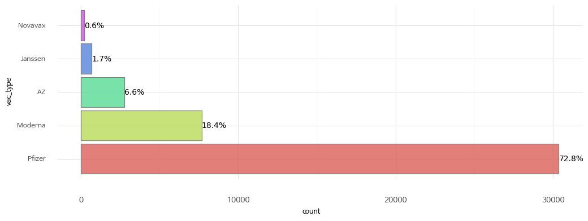

### _모든 데이터는 SHINE 앱 이용자의 자발적인 기록으로 정확성을 담보하지 않으며, 데이터 활용에 의한 책임은 이용자에게 있습니다._

## 특징

* SHINE에 업로드한 백신접종 데이터는 자발적인 기록으로, 한 사용자가 1/2차 백신접종을 완료했으나 2차 백신접종만 기록할 수도 있습니다.

## 컬럼 정보

21,693행과 39개의 컬럼을 갖고 있으며, 컬럼은 아래 4개 유형의 정보를 담고 있습니다.

1\. 유저 정보

| 컬럼명 | 설명 | 예시 |
|-------|-----|-----|
| age_group | 연령대 | 30 |
| gender | 성별 | 남 |

2\. 기저질환 정보

| 컬럼명 | 설명 | 예시 |
|-------|-----|-----|
| underlying_disease | 기저질환 보유 여부 | 있음 |

3\. 백신접종 정보

| 컬럼명 | 설명 | 예시 |
|-------|-----|-----|
| dose_1_date | 1차 접종일 | 2021-01-21 |
| dose_1_type | 1차 접종 백신종류 | AZ |
| dose_2_date | 2차 접종일 | 2021-02-22 |
| dose_2_type | 2차 접종 백신종류 | 화이자 |
| dose_3_date | 3차 접종일 | 2021-03-23 |
| dose_3_type | 3차 접종 백신종류 | 얀센 |
| dose_4_date | 4차 접종일 | 2021-04-24 |
| dose_4_type | 4차 접종 백신종류 | 모더나 |

미입력한 정보는 - 로 처리되어 있습니다.

4\. 증상 정보

차수별 백신 접종 후 나타난 증상에 대한 정보입니다.

| 컬럼명 | 설명 | 예시 |
|-------|-----|-----|
| dose_1_post_allegy | 1차 접종 알러지반응 | 1`4 |
| dose_1_post_fatigue | 1차 접종 피로감 | 1 |
| dose_1_post_fever | 1차 접종 발열 | 1 |
| dose_1_post_inject_pain | 1차 접종 접중부위 통증 | 1 |
| dose_1_post_inject_swell | 1차 접종 접종부위 붓기 | 2 |
| dose_1_post_pain | 1차 접종 통증(접종부위 외) | 2`3 |
| dose_1_post_vomit | 1차 접종 구역질 | 3 |
| dose_2_post_allegy | 2차 접종 알러지반응 | 1`4 |
| dose_2_post_fatigue | 2차 접종 피로감 | 1 |
| dose_2_post_fever | 2차 접종 발열 | 1 |
| dose_2_post_inject_pain | 2차 접종 접중부위 통증 | 1 |
| dose_2_post_inject_swell | 2차 접종 접종부위 붓기 | 2 |
| dose_2_post_pain | 2차 접종 통증(접종부위 외) | 2`3 |
| dose_2_post_vomit | 2차 접종 구역질 | 3 |
| dose_3_post_allegy | 3차 접종 알러지반응 | 1`4 |
| dose_3_post_fatigue | 3차 접종 피로감 | 1 |
| dose_3_post_fever | 3차 접종 발열 | 1 |
| dose_3_post_inject_pain | 3차 접종 접중부위 통증 | 1 |
| dose_3_post_inject_swell | 3차 접종 접종부위 붓기 | 2 |
| dose_3_post_pain | 3차 접종 통증(접종부위 외) | 2`3 |
| dose_3_post_vomit | 3차 접종 구역질 | 3 |
| dose_4_post_allegy | 4차 접종 알러지반응 | 1`4 |
| dose_4_post_fatigue | 4차 접종 피로감 | 1 |
| dose_4_post_fever | 4차 접종 발열 | 1 |
| dose_4_post_inject_pain | 4차 접종 접중부위 통증 | 1 |
| dose_4_post_inject_swell | 4차 접종 접종부위 붓기 | 2 |
| dose_4_post_pain | 4차 접종 통증(접종부위 외) | 2`3 |
| dose_4_post_vomit | 4차 접종 구역질 | 3 |

## 컬럼별 기초 정보

### 유저 정보

1\. 성별

| 값 | 설명 |
|-------|-----|
| M | 남성 |
| F | 여성 |

2\. 연령대

연령대는 숫자로만 표시되어 있습니다. 예를 들어, 20은 20~29세를 의미합니다.
예외적으로 10은 14~19세이며, 70은 70세 이상의 모든 연령을 나타냅니다.

### 기저질환 정보

| 값 | 설명 |
|-------|-----|
| Y | 기저질환 있음 |
| N | 기저질환 없음 |

\* 기저질환: 당뇨, 고혈압, 만성심혈관질환, 만성뇌혈관질환, 신경근육계질환, 만성폐쇄성질환, 천식, 만성폐질환, 만성신장질환, 투석, 만성간질환, 암, 혈액암, 골수이식, 장기이식, 자가면역/류마티스질환, 면역억제제 투약

### 백신접종 정보

1\. 백신 접종일 분포

2\. 백신 차수

3\. 백신종류

| 값 | 설명 |
|-------|-----|
| Pfizer | 화이자 |
| Moderna | 모더나 |
| AZ | 아스트라제네카 |
| Novavax | 노바벡스 |
| Janssen | 얀센 |

### 증상 정보

1\. 알러지 반응

| 값 | 설명 |
|-------|-----|
| 0 | 없음 |
| 1 | 발진 |
| 2 | 두드러기 |
| 3 | 가려움증 |
| 4 | 얼굴 또는 입술 부위 붓기 |
| - | 미입력 |

\* 중복선택을 **\`** 로 구분

2\. 피로감

| 값 | 설명 |
|-------|-----|
| 0 | 증상 없음 |
| 1 | 증상 있음 |
| - | 미입력 |

3\. 발열

| 값 | 설명 |
|-------|-----|
| 0 | 증상 없음 |
| 1 | 증상 있음 |
| - | 미입력 |

4\. 접종부위 통증

| 값 | 설명 |
|-------|-----|
| 0 | 증상 없음 |
| 1 | 증상은 있으나 약먹을 정도는 아님 |
| 2 | 1~2일 약을 먹어야 팔을 움직이는 데 지장이 없는 정도 |
| 3 | 3일 이상 통증이 지속되거나, 약을 먹어도 통증 조절이 안됨 |
| - | 미입력 |

5\. 접종부위 붓기

| 값 | 설명 |
|-------|-----|
| 0 | 증상 없음 |
| 1 | 직경 5cm 이하 |
| 2 | 5~10cm (움직이기 불편한) |
| 3 | 10cm 이상이며, 활동하기 어려움 |
| 4 | 농양 생김 |
| - | 미입력 |

6\. 통증(접종부위 외)

| 값 | 설명 |
|-------|-----|
| 0 | 증상 없음 |
| 1 | 두통 |
| 2 | 관절통 |
| 3 | 근육통 |
| - | 미입력 |

\* 중복선택을 **\`** 로 구분

7\. 구역질

| 값 | 설명 |
|-------|-----|
| 0 | 증상 없음 |
| 1 | 구역감이 있으나, 일상 생활이 불편한 정도는 아님 |
| 2 | 하루에 1~2회 발생 |
| 3 | 하루에 3회 이상 발생 |
| - | 미입력 |
