SHINE 모바일앱에서 수집된 코로나19 셀프체크 데이터입니다. SHINE앱 이용자가 앱에서 셀프체크를 할 때 입력하게 되는 정보와 코로나19 PCR 검사결과, 코로나19 백신접종 기록이며, 2022년 6월까지 수집된 데이터의 일부를 익명화하여 제공합니다.

## 특징

* 셀프체크와 PCR검사결과 기록에 이용 회수에 제한은 없습니다. 따라서 이용자당 여러개의 셀프체크 데이터가 있으며, 공개하는 데이터는 PCR 검사결과와 함께 PCR 검사일 전후 7일 내의 가장 가까운 셀프체크 날짜의 입력데이터입니다.
* SHINE에 입력한 모든 데이터는 이용자의 자발적인 기록이지만, PCR검사, 백신접종 기록은 증빙자료를 확인한 데이터입니다.

## 컬럼 정

12,656행과 22개의 컬럼을 갖고 있으며, 컬럼은 아래 5개 유형의 정보를 담고 있습니다.

1\. 유저 정보

| 컬럼명 | 설명 | 예시 |
|-------|-----|-----|
| age_group | 연령대 | 30 |
| gender | 성별 | 남 |

2\. 건강상태 정보

| 컬럼명 | 설명 | 예시 |
|-------|-----|-----|
| underlying_disease | 기저질환 보유 여부 | 있음 |
| smoking | 흡연 여부 | 비흡연 |

3\. 코로나19 검사 정보

| 컬럼명 | 설명 | 예시 |
|-------|-----|-----|
| pcr_date | 코로나19 PCR 검사일 | 2022-03-02 |
| pcr_result | 코로나19 PCR 검사결과 | 양성 |

4\. 백신접종 정보

| 컬럼명 | 설명 | 예시 |
|-------|-----|-----|
| dose_1_date | 1차 접종일 | 2021-01-21 |
| dose_1_type | 1차 접종 백신종류 | AZ |
| dose_2_date | 2차 접종일 | 2021-02-22 |
| dose_2_type | 2차 접종 백신종류 | 화이자 |
| dose_3_date | 3차 접종일 | 2021-03-23 |
| dose_3_type | 3차 접종 백신종류 | 얀센 |
| dose_4_date | 4차 접종일 | 2021-04-24 |
| dose_4_type | 4차 접종 백신종류 | 모더나 |

\* 미입력한 정보는 - 로 처리되어 있습니다.

5\. 증상 정보

| 컬럼명 | 설명 | 예시 |
|-------|-----|-----|
| selfcheck_date | 셀프체크 증상 입력일 | 2022-02-10 |
| fever | 발열 여부 | 있음 |
| fever_temp | 발열 온도 | 38 |
| fever_period | 발열 지속기간 | 3일 |
| symptom | 발생한 증상 종류 | 2`3 |
| group_infection_area | 집단발생지역 방문여부 | 모름 |
| selfcheck_reason | 셀프체크 실행 사유 | 1`5 |

## 데이터 기초 정보

### 유저 정보

1\. 성별 분포

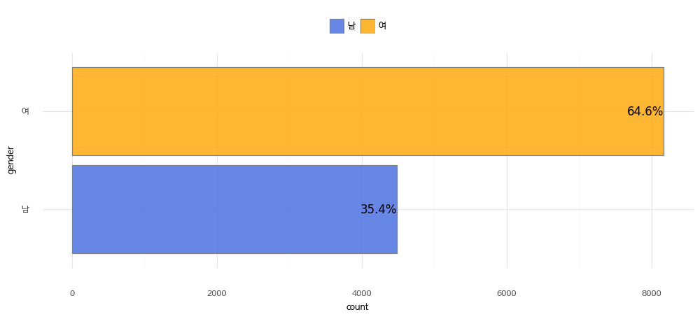

2\. 연령대 분포

연령대는 숫자로만 표시되어 있습니다. 예를 들어, 20은 20~29세를 의미합니다.
예외적으로 10은 14~19세이며, 70은 70세 이상의 모든 연령을 나타냅니다.

### 건강상태 정보

1\. 기저질환 분포

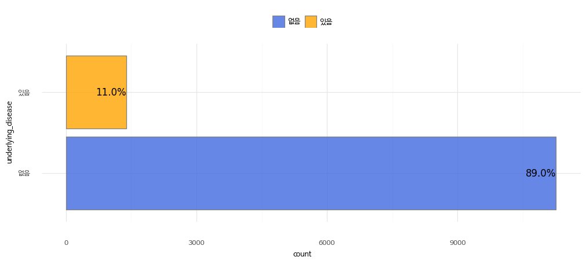

\* 기저질환: 당뇨, 고혈압, 만성심혈관질환, 만성뇌혈관질환, 신경근육계질환, 만성폐쇄성질환, 천식, 만성폐질환, 만성신장질환, 투석, 만성간질환, 암, 혈액암, 골수이식, 장기이식, 자가면역/류마티스질환, 면역억제제 투약

2\. 흡엽여부 분포

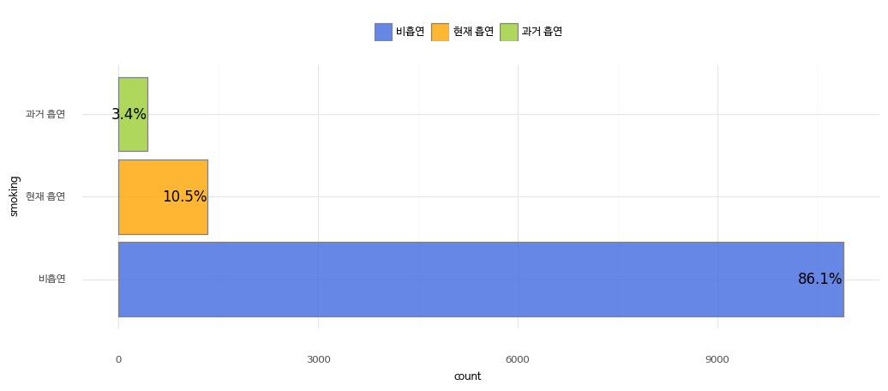

### 코로나19 검사 정보

1\. PCR 검사결과 분포

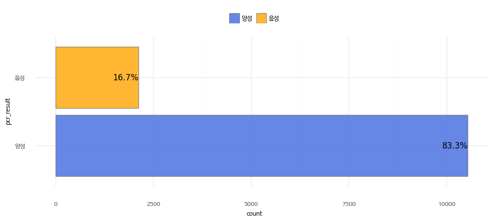

2\. 일별 검사결과 분포

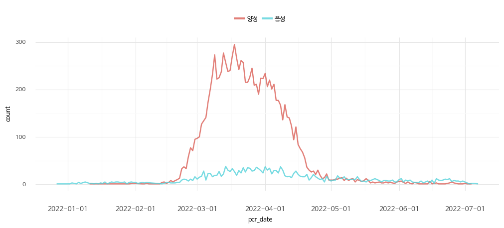

### 백신접종 정보

1\. 차수별 분포

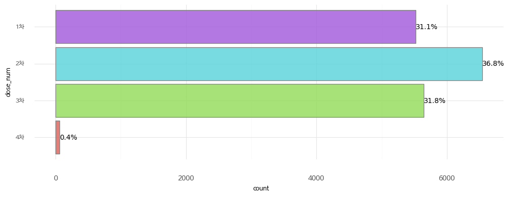

2\. 백신종류 분포

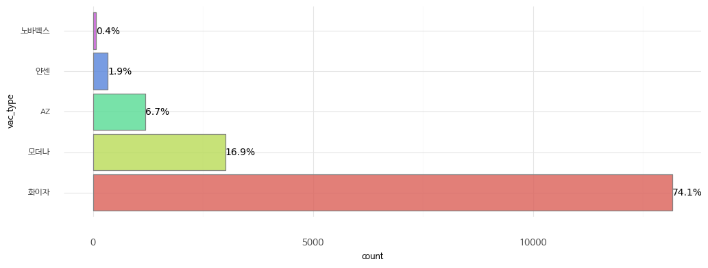

3\. 백신 접종일별 분포

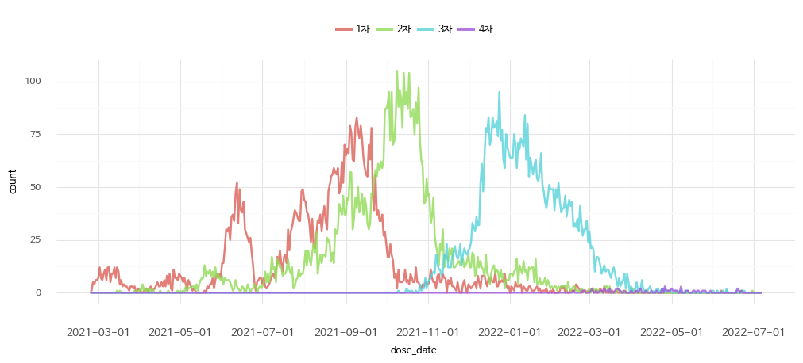

### 증상 정보

1\. 셀프체크 증상 입력일

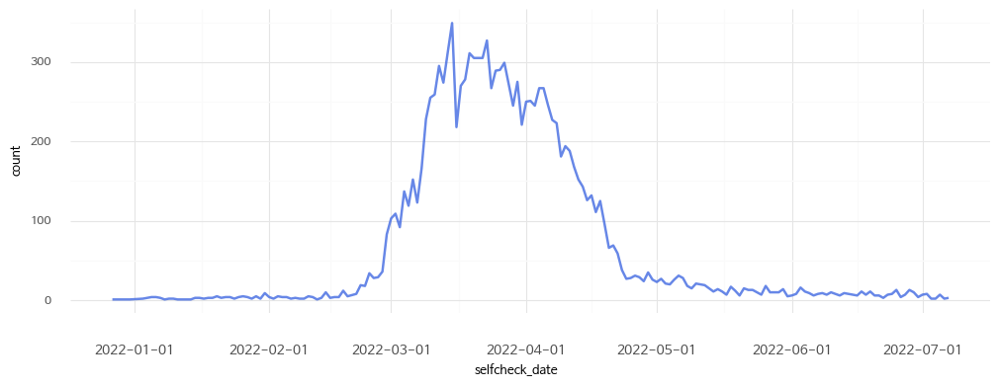

2\. 발열 여부

| 값 | 설명 |
|-------|-----|
| 0 | 없음 |
| 1 | 있음 |

3\. 발열 온도 분포

| 값 | 설명 |
|-------|-----|
| 0 | 미입력 |
| 수치값 | 입력 체온 |

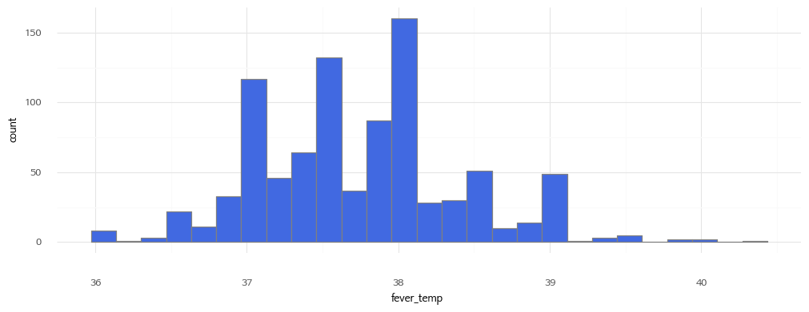

\* 0(미입력)을 제외한 값의 분포
\* 발열 온도는 이용자가 수기로 입력한 수치임

4\. 발열 지속기간

| 값 | 설명 |
|-------|-----|
| 없음 | 발열 없음 |
| 1일 | 발열 1일 지속|
| 2일 | 발열 2일 지속|
| 3일 | 발열 3일 지속|
| 3일 | 발열 4일 지속|

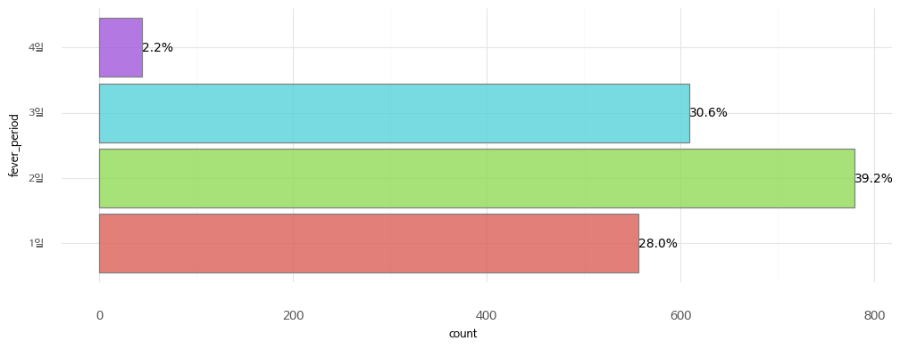

5\. 발생한 증상 종류

| 값 | 설명 |
|-------|-----|
| 0 | 없음 |
| 1 | 가래 |
| 2 | 가슴통증 |
| 3 | 근육통 |
| 4 | 눈 충혈 |
| 5 | 늘어지고 피곤함 |
| 6 | 두통 |
| 7 | 마른 기침 |
| 8 | 몸통발진 |
| 9 | 미각소실 |
| 10 | 변비 |
| 11 | 설사 |
| 12 | 숨참 |
| 13 | 오한 |
| 14 | 인후통(목통증) |
| 15 | 입맛없음 |
| 16 | 입술 주변 물집 |
| 17 | 입술 파래짐 |
| 18 | 재채기 |
| 19 | 콧물 |
| 20 | 피가 섞인 기침 |
| 21 | 후각소실 |
| 22 | 기타 |

\* 중복선택을 **\`** 로 구분

6\. 집단감염 발생지역 방문 여부

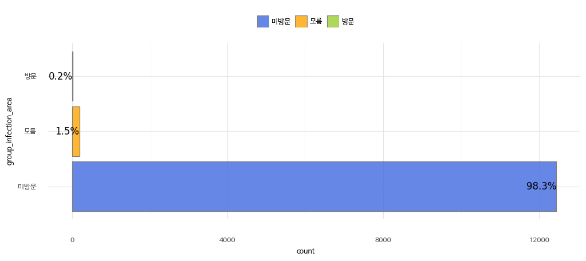

7\. 셀프체크 사유

| 값 | 설명 |
|-------|-----|
| 1 | 본인 판단 |
| 2 | 자가격리 |
| 3 | 자가격리 해제 전 |
| 4 | 유증상자 |
| 5 | 보건소 연락 및 재난문자 |
| 6 | 해외입국자 |
| 7 | 선제 검사 |
| 8 | 확진자 접촉 |
| 9 | 해외입국자 접촉 |
| 10 | 집단감염 발생지역 방문 |
