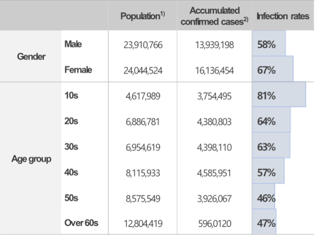
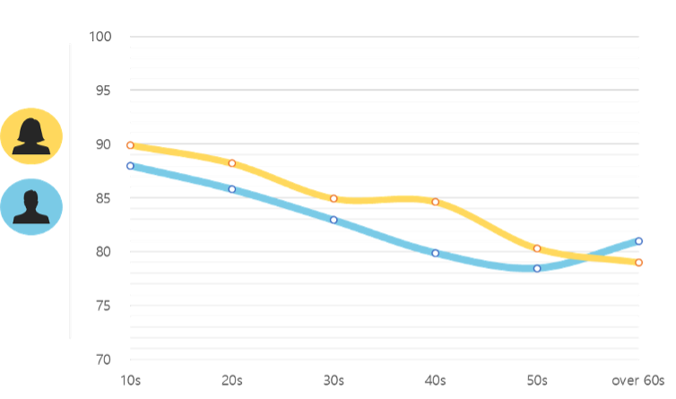
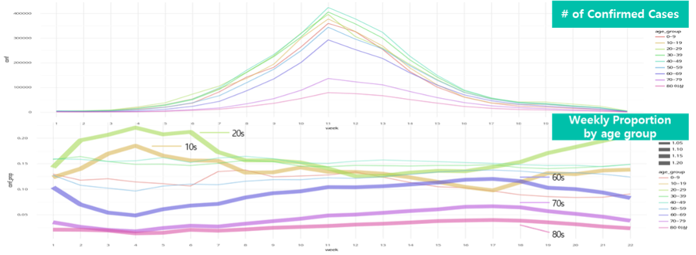
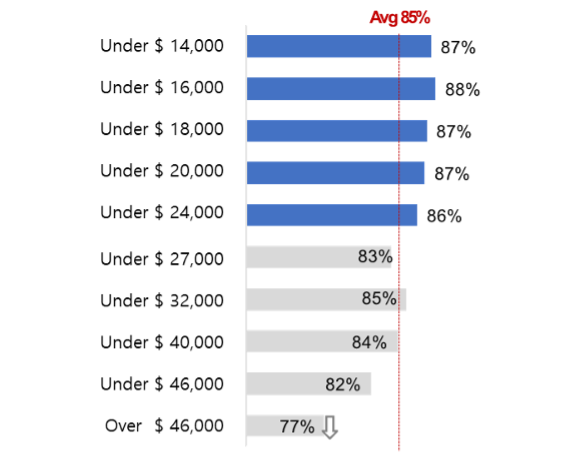

지난 3년간 우리는 코로나19에 감염되지 않기 위해 애썼다. 누가 위험한지, 어디가 위험한지 알아내려 했고, 집 밖의 장소에서 누군가를 만날 때마다 마스크로 얼굴을 감싸고 손을 소독했다. 그러던 와중에 언젠가부터 주변에서 많은 사람들이 코로나19에 감염되어 일주일간 모습을 보이지 않았다가 기침을 하며 다시 나타나곤 했다. 필자 주변은 주로 자녀로부터의 감염 또는 직장과 모임을 통해 감염되었고, 직장에서 미감염자를 손으로 셀 수 있게 될 무렵, 필자도 코로나19에 걸리게 되었다.

<<<<<<< HEAD
코로나19에서 회복되고 한참 후, 차에 저소득층, 취약계층일수록 코로나19 이후 일상회복이 더뎠다는 언론보도를 보았다. 사회적 취약계층이 감염병의 회복에도 취약했다는 것이다. 감염병 회복이 아니라 감염에도 취약한 사회적 집단이 있을지 궁금했다. 감염에 취약하다는 것은 회복이 더디다는 것과는 파급력이 다르다. 감염에 취약한 계층이 있고, 이들의 사회적 영향도가 크다면 진지하게 살펴보아야 할 문제다.

이러한 동기와 여러 기관의 도움으로 ‘인구사회학적 감염병 취약 계층 특성 분석’ 연구를 시작하게 되었다. 개인의 건강 특성이 아닌 사회적 특성 관점에서 코로나19 감염에 대해 누가 더 위험하고, 무엇 때문에 위험한지 분석했다.

=======
지난 3년간 우리는 코로나19에 감염되지 않기 위해 애썼다. 누가 위험한지, 어디가 위험한지 알아내려 했고, 집 밖의 장소에서 누군가를 만날 때마다 마스크로 얼굴을 감싸고 손을 소독했다. 그러던 와중에 언젠가부터 주변에서 많은 사람들이 코로나19에 감염되어 일주일간 모습을 보이지 않았다가 기침을 하며 다시 나타나곤 했다. 필자 주변은 주로 자녀로부터의 감염 또는 직장과 모임을 통해 감염되었고, 직장에서 미감염자를 손으로 셀 수 있게 될 무렵, 필자도 코로나19에 걸리게 되었다.

코로나19에서 회복되고 한참 후, 차에 저소득층, 취약계층일수록 코로나19 이후 일상회복이 더뎠다는 언론보도를 보았다. 사회적 취약계층이 감염병의 회복에도 취약했다는 것이다. 감염병 회복이 아니라 감염에도 취약한 사회적 집단이 있을지 궁금했다. 감염에 취약하다는 것은 회복이 더디다는 것과는 파급력이 다르다. 감염에 취약한 계층이 있고, 이들의 사회적 영향도가 크다면 진지하게 살펴보아야 할 문제다.

이러한 동기와 여러 기관의 도움으로 ‘인구사회학적 감염병 취약 계층 특성 분석’ 연구를 시작하게 되었다. 개인의 건강 특성이 아닌 사회적 특성 관점에서 코로나19 감염에 대해 누가 더 위험하고, 무엇 때문에 위험한지 분석했다.
>>>>>>> 4724c2377fa24792d421c06ffd7eac83766d68b7

### 연구 방법

<<<<<<< HEAD
인구와 사회적 특성에 따라 코로나19 감염 위험의 차이가 있는지 분석했다. 그러기 위해서는 개인의 인구사회학적 프로파일 정보와 코로나19 감염에 대한 정보가 모두 있어야 한다. KT는 감염병 감시 및 연구를 위해 ‘SHINE’이라는 모바일 앱을 개발해 출시했으며, 이 앱을 통해 코로나19와 관련된 다양한 정보를 수집했다. 그러나 우리가 수집한 정보 중 본 연구에 활용할 수 있는 정보는 개인의 기초적인 인구적 특성(성별, 나이 등)과 코로나19 감염 정보 들이었고, 우리가 갖고 있는 정보만으로는 원하는 결과를 얻을 수 없어서 다른 기관이 갖고 있는 정보와 결합하는 것이 필요했다.

우리는 한국지능정보사회진흥원, ㈜제로투원파트너스, ㈜유피에스데이터, ㈜NICE평가정보와 협업하여, 가명정보 결합이라는 제도를 이용해 연구를 진행했다. SHIINE 데이터를 가명화해 개인의 직업, 소득 등에 대한 정보를 갖고 있는 NICE 평가정보의 가명화된 데이터와 결합하였다*. 이후, 결합한 정보를 통해 인구사회학적 특성에 따른 감염율의 차이를 살펴보고, 그 원인에 대해 추론하였다.

> ***연구 활용 데이터에 대한 설명**: 2022년1월부터 4월까지 SHINE 앱에서 코로나19 PCR 검사결과를 입력한 사용자 15,001명의 PCR 검사정보, 성별, 연령대, 기저질환 보유 유무, 거주유형, 직업분류, 신용정보, 소득수준

=======
### 연구 방법

인구와 사회적 특성에 따라 코로나19 감염 위험의 차이가 있는지 분석했다. 그러기 위해서는 개인의 인구사회학적 프로파일 정보와 코로나19 감염에 대한 정보가 모두 있어야 한다. KT는 감염병 감시 및 연구를 위해 ‘SHINE’이라는 모바일 앱을 개발해 출시했으며, 이 앱을 통해 코로나19와 관련된 다양한 정보를 수집했다. 그러나 우리가 수집한 정보 중 본 연구에 활용할 수 있는 정보는 개인의 기초적인 인구적 특성(성별, 나이 등)과 코로나19 감염 정보 들이었고, 우리가 갖고 있는 정보만으로는 원하는 결과를 얻을 수 없어서 다른 기관이 갖고 있는 정보와 결합하는 것이 필요했다.

우리는 한국지능정보사회진흥원, ㈜제로투원파트너스, ㈜유피에스데이터, ㈜NICE평가정보와 협업하여, 가명정보 결합이라는 제도를 이용해 연구를 진행했다. SHIINE 데이터를 가명화해 개인의 직업, 소득 등에 대한 정보를 갖고 있는 NICE 평가정보의 가명화된 데이터와 결합하였다*. 이후, 결합한 정보를 통해 인구사회학적 특성에 따른 감염율의 차이를 살펴보고, 그 원인에 대해 추론하였다.

> ***연구 활용 데이터에 대한 설명**: 2022년1월부터 4월까지 SHINE 앱에서 코로나19 PCR 검사결과를 입력한 사용자 15,001명의 PCR 검사정보, 성별, 연령대, 기저질환 보유 유무, 거주유형, 직업분류, 신용정보, 소득수준
>>>>>>> 4724c2377fa24792d421c06ffd7eac83766d68b7

### 직업에 따른 감염율 차이

<<<<<<< HEAD
코로나 감염 여부에 연관성이 큰 인구사회학적 특성은 직업군, 연령, 소득, 신용평점 순으로 연관성이 높았다*. 먼저, 직업군에 따른 코로나19 감염율의 차이를 살펴보면 그림1과 같다.

=======
### 직업에 따른 감염율 차이

코로나 감염 여부에 연관성이 큰 인구사회학적 특성은 직업군, 연령, 소득, 신용평점 순으로 연관성이 높았다*. 먼저, 직업군에 따른 코로나19 감염율의 차이를 살펴보면 그림1과 같다.

>>>>>>> 4724c2377fa24792d421c06ffd7eac83766d68b7
> ***코로나 감염 여부에 대해 각 특성의 영향도 산출 방식**:
> - 코로나 감염 여부에 통계적 차이를 보인 인구사회학적 특성을 독립변수로 하여, 코로나 감염 여부 예측에 대한 트리모델을 생성
> - 생성된 트리모델에서 각 변수가 코로나 감염 여부를 예측하는데 얼마나 기여하는지에 따라 상대적 영향력(feature importance)를 산출하였음

<figure>
  
  <figcaption>그림 1. 직업군별 코로나19 감염율</figcaption>
</figure>

대면 접촉이 많은 서비스 업종의 코로나19 감염율이 상대적으로 높았다. 가장 감염율이 높은 업종은 예술, 스포츠, 여가 서비스업으로 이 업종의 특성은 밀폐된 공간에서 긴 시간 동안 타인과 상호작용하는 업종이다. 일반적으로 코로나19의 감염위험이 높다고 알려진 환경의 근무자가 실제 코로나19 감염율이 더 높은 것으로 확인되었다. 그 외 숙박 및 음식점업, 운수업, 개인 서비스업 등도 실내에서 활동하는 직업군으로 코로나19 감염율이 높은 직업군으로 나타났다.

반면, 전기, 가스, 수도, 하수 등 시설물과 관련된 업종은 코로나19 감염율이 낮은 업종이었다. 코로나19와 같은 호흡기 감염병의 전파 특성이 그대로 반영된 결과였다. 한가지 특이사항은 보건업(병의원) 및 사회복지 서비스업은 대면 접촉이 많은 직종이지만, 코로나19 감염율은 오히려 낮았다. 해당 업종의 특성상 철저한 감염 예방 수칙 준수와 정부의 방역과 감독이 강화된 장소라는 특성이 반영된 것으로 보인다.

### 인구 통계별 감염율 차이

질병관리청에서 발표한 성별, 연령에 따른 코로나19 감염율 현황을 분석하면, 그림2와 같이 여성과 연령이 낮은 인구의 감염율이 상대적으로 높게 나타난다. SHINE 에서도 동일한 결과를 보였는데 10대부터 50대까지의 여성 감염율이 남성보다 더 높은 것을 확인할 수 있다.

<figure>
  
  <figcaption><em>1) 인구주택총조사(2020), 10세 이상의 인구수</em></figcaption>
  <figcaption><em>2) 질병관리청, 코로나바이러스감염증 국내 발생 현황(23.1.26현재) (https://ncov.kdca.go.kr)</em></figcaption>
  <figcaption>그림 2. 성별, 연령대별 코로나19 감염 현황(질병관리청 자료와 인구주택조사 자료 결합)</figcaption>
</figure>

<figure>
  
  <figcaption>그림 3. 성별, 연령대별 코로나19 감염 현황(SHINE, 2022년 1~4월)</figcaption>
</figure>

그렇다면, 여성과 저연령층이 감염율이 높은 이유는 무엇일까?

저연령층이 감염율이 높은 이유를 먼저 살펴보면, 저연령층은 고연령층보다 사회적 활동이 더 많다. 학교, 직장 등 해당 연령대의 다수가 대면 접촉이 높은 사회활동을 하고 있다. 그에 따라 저연령층이 고연령층보다 대면 접촉기회가 많기 때문에 감염율이 더 높은 것으로 생각해 볼 수 있다. 그렇다면 코로나19가 확산되는 과정은 사회활동이 많은 저연령층의 감염이 우선적으로 발생하고 이후 고연령층의 감염으로 이어지는 순서로 확산되는 것은 아닌지 추측해 볼 수 있다. 그림4은 2022년 초 코로나19 대규모 유행 시기에 코로나19 확진자를 연령대별로 구분해 표현한 그래프이다.

<figure>
  
  <figcaption>그림 4. 한국의 연령대별 코로나19 감염 추이(2022년 1~6월 주단위, 보건복지부 공공데이터)</figcaption>
</figure>

그림4의 위 그래프는 연령대별 확진자 수를 주단위로 나타낸 것이며, 아래 그래프는 연령대별 확진자 비중을 주단위로 나타낸 그래프이다. 확산 초기에는 10대와 20대의 감염율이 다른 연령대보다 감염율이 높다가, 확산이 진행될수록 감염율이 낮아지는 양상을 보인다. 반면, 고연령층인 60대 이상은 전체 확진자가 적은 시기에는 비중이 작았으나 확산이 지속될수록 전체 확진자에서 비중이 높아졌다. 저연령층에서 코로나19가 먼저 유행한 것으로 해석할 수 있는 부분이다. 이 시기에 3차 백신접종율이 연령대별로 큰 차이를 보였는데*, 많은 사회활동과 낮은 백신접종율이 합쳐져 나타난 결과로 보인다. 10대, 20대, 그리고 60대 이상을 제외한 연령층에서는 위 그래프의 전체 기간 동안 확진자 비중이 큰 차이가 없어, 두 연령대 그룹은 코로나19 유행 시점 별로 다른 확산 양상이 있다고 생각해 볼 수 있다.

> *2022년 1월 24일에 질병관리청이 발표한 연령대별 3차 백신접종율은 10대 8%, 20대 32.9%, 30대 36.0%, 40대, 41.2%, 50대 64.3%이며, 60대 이상은 80% 이상이다.

또한, 유행 웨이브가 끝나는 시점에는 전체 확진자에서 저연령층의 비중이 다시 커지고 고연령층의 비중이 낮아진다. 이는 코로나19의 유행이 다시 작아지면서, 사회 전체적으로 유행하는 확산 양상에서 확산 초기와 같은 국지적 확산 양상으로 변화되어 대면 접촉 가능성이 높은 연령대가 감염이 높아지는 것으로 추정한다.

### 경제적 계층에 의한 차이

이 질문에 대해서는 앞서 이야기한 분석결과들을 종합하여 결론을 내릴 수 있을 것이다. 서비스 직업군, 여성 및 저연령층은 상대적으로 소득이 낮은 집단이다*. 그러므로, 이들의 감염율이 높았으므로 경제적 취약계층이 감염율이 더 높을 것이라는 추론이 가능하다. 실제 데이터도 이를 뒷받침하는지 살펴본다.

<figure>
  
  <figcaption>그림 5. 연소득 구간별 코로나19 감염율 (SHINE)</figcaption>
</figure>

연소득을 10개 그룹으로 나누었을 때 연소득 5분위 이하는 평균보다 감염율이 높았고, 5분위 이상은 평균보다 감염율이 낮았다. 연소득이 낮은 집단이 상대적으로 코로나19 감염에 더 취약하다는 결과가 나온다. 이 데이터를 바탕으로 경제적 취약계층이 감염위험이 더 높기에 그들을 위한 대책이 필요하다고 결론지어야 할까? 이 데이터에서 주목해야할 부분은 5분위 이하의 감염율이 평균보다 1~2% 높다는 것이 아니라, 10분위 이상 고소득자의 감염율이 평균보다 현저히 낮다는 점이다. 이 결과는 연령대별로 연소득 구간을 나누어 분석해도 같은 패턴이 나타났다. 연소득 10분위 이상인 집단이 다른 집단 대비 감염율이 낮은 요인을 분석하여, 타집단의 감염위험을 낮출 수 있는 방안을 모색하자는 것이 올바른 결론일 것이다.
<<<<<<< HEAD

우리는 앞서 말한 요인을 자세히 분석하기 위해 고용노동부가 공개한 직업군에 따른 임금분포 데이터를 이용해 간접적으로 해석해 보았다. 우리가 확보한 데이터는 연소득과 직업군을 결합해 분석할 때 모수가 작아 유의한 분석이 어려웠기 때문이다. 고용노동부의 자료에 의하면 직업을 8개의 대분류로 나누었을 때의 임금수준은 표1과 같이 나타난다. 연소득 10분위는 평균임금을 기준으로 할 때, 관리자와 전문가 및 관련 종사자에 해당하는 임금이다. 조금 넓게 잡으면 사무 종사자까지는 코로나19 감염율이 타 직업대비 낮다고 할 수 있다. 관리자를 비롯해 사무직 근무자들은 근무중에 접촉하게 되는 인구가 한정적일 가능성이 높다. 불특정 다수와 밀접한 거리에서 접촉하여 코로나19에 노출될 가능성이 상대적으로 적을 것이다. 

사업체 규모에 따른 소득을 봤을 때 사업체 규모가 클수록 평균소득이 높고, 연평균 임금을 기준으로 500명 이상인 사업체에서 일하는 개인은 코로나19 감염위험이 낮다고 추정할 수 있다. 코로나19가 확산된 이후 많은 기업체에서 재택근무를 시행하는 등 종사자의 안전을 위한 정책들이 시행되었다. 이러한 정책들도 주로 사무직 위주의 사업체와 사업체 규모가 큰 사업체에서 시행되어, 연소득이 높은 집단의 코로나19 감염위험을 낮추는 요인이 되었을 것이다.

=======

우리는 앞서 말한 요인을 자세히 분석하기 위해 고용노동부가 공개한 직업군에 따른 임금분포 데이터를 이용해 간접적으로 해석해 보았다. 우리가 확보한 데이터는 연소득과 직업군을 결합해 분석할 때 모수가 작아 유의한 분석이 어려웠기 때문이다. 고용노동부의 자료에 의하면 직업을 8개의 대분류로 나누었을 때의 임금수준은 표1과 같이 나타난다. 연소득 10분위는 평균임금을 기준으로 할 때, 관리자와 전문가 및 관련 종사자에 해당하는 임금이다. 조금 넓게 잡으면 사무 종사자까지는 코로나19 감염율이 타 직업대비 낮다고 할 수 있다. 관리자를 비롯해 사무직 근무자들은 근무중에 접촉하게 되는 인구가 한정적일 가능성이 높다. 불특정 다수와 밀접한 거리에서 접촉하여 코로나19에 노출될 가능성이 상대적으로 적을 것이다. 

사업체 규모에 따른 소득을 봤을 때 사업체 규모가 클수록 평균소득이 높고, 연평균 임금을 기준으로 500명 이상인 사업체에서 일하는 개인은 코로나19 감염위험이 낮다고 추정할 수 있다. 코로나19가 확산된 이후 많은 기업체에서 재택근무를 시행하는 등 종사자의 안전을 위한 정책들이 시행되었다. 이러한 정책들도 주로 사무직 위주의 사업체와 사업체 규모가 큰 사업체에서 시행되어, 연소득이 높은 집단의 코로나19 감염위험을 낮추는 요인이 되었을 것이다.

>>>>>>> 4724c2377fa24792d421c06ffd7eac83766d68b7
| 직업대분류                               | 임금(평균) | 임금(중위) |
| :------------------------------------------------ | :-----------------: | :------------------: |
| 1 관리자                                         | 144,107            | 114,547             |
| 2 전문가 및 관련 종사자                | 59,817             | 47,218              |
| 3 사무 종사자                                  | 57,600             | 46,426              |
| 4 판매 종사자                                    | 48,253             | 39,045              |
| 5 기능원 및 관련 기능 종사자      | 44,691             | 39,108              |
| 6 장치, 기계조작 및 조립종사자 | 43,015             | 36,776              |
| 7 서비스 종사자                                 | 29,797             | 26,659              |
| 8 단순노무 종사자                                 | 29,312             | 26,817              |
 
| 사업체 규모           | 임금(평균) | 임금(중위) |
| :--------------------- | :-----------------: | :------------------: |
| 1    5~29명    | 45,050             | 34,760              |
| 2    30~99명   | 46,589             | 37,729              |
| 3    100~299명 | 51,042             | 41,474              |
| 4    300~499명 | 59,054             | 49,769              |
| 5    500명 이상   | 79,155             | 71,012              |

| 성별      | 임금(평균) | 임금(중위) |
| :---------- | :-----------------: | :------------------: |
| 1    남자   | 59,020             | 47,243              |
| 2    여자 | 40,982             | 31,907              |

<figcaption><em>단위: 천원</em></figcaption>
<figcaption>표 1. 고용노동부의 사업체 특성별 임금분포현황 데이터(‘22년 6월 기준)</figcaption>

### 비 감염성 질병과의 비교

지금까지 살펴본 것처럼 몇가지 인구사회학적 요인들이 코로나19라는 감염병에서 감염 위험의 유의미한 차이를 보였다. 이러한 요인들은 감염병이 아닌 다른 질병에서도 비슷하게 위험을 높이는 것으로 보인다. 2020년 한국보건간호학회지에 실린 연구결과를 보면, 비감염성 질환인 만성질환(고혈압, 고혈당, 이상지질혈증)에 대해서 교육수준, 소득이 낮을수록 부정적인 결과를 보였다*. 우리의 연구결과와 일맥상통하는 결과로, 저소득층은 감염병과 비감염성 질병 모두에서 위험이 높다. 사회 계층에 따른 생활 수준, 건강에 대한 인식과 관리의 차이가 원인인 것으로 보인다. 코로나19 감염위험이 높은 사회 계층을 감염병뿐만 아니라, 전반적인 건강불평등의 관점에서 바라보고 대응해야 하는 이유다.

> *김윤정, 안보미. (2020). 우리나라 성인의 사회경제적 요인이 건강 수준에 미치는 영향: 7기 국민건강영양조사를 중심으로. 한국보건간호학회지, 34(3), 416-428.

### 결론 및 고찰

몇가지 인구사회학적 특성과 코로나19 감염율을 분석하면서 코로나19 감염에 취약한 집단을 찾아보았다. 서비스 직업군과 여성, 저연령층은 타 집단 대비 코로나19 감염위험이 더 높은 것으로 나타났다. 특히, 저연령층은 코로나19가 확산되는 초기에 상대적으로 감염율이 높았다. 그리고 연소득이 가장 높은 집단의 코로나19 감염율이 상대적으로 낮았는데, 이는 연소득이 높은 집단의 근무환경에 기인한 것으로 보인다. 이 외에 거주유형(아파트, 단독주택)에 의해서는 감염율의 유의미한 차이가 없었다.

코로나19 감염위험이 높은 인구사회학적 특성들을 하나로 종합하면 ‘타인 접촉 가능성이 높은 집단’이다. 직업군과 연령, 연소득 모두 타인을 접촉할 가능성이 높은 집단에서 코로나19의 위험이 높게 나타났다. 감염병의 특성을 생각할 때 너무나 당연한 결론이다. 그러나, 감염병의 특성대로 현상이 나타났다는 것은 우리의 감염병 대응이 부족하지는 않았는지 고찰해 보게 한다.

고연령자, 기저질환자 등을 코로나19 고위험군으로 이야기한다. 코로나19 감염 시 중증 위험이 높기 때문이다. 이러한 의료 및 보건 관점의 고위험군이 아닌 “사회적 관점의 고위험군”을 추가로 정의해보는 것은 어떨까. 우리가 분석한 “사회적 고위험군”의 감염은 타인 접촉이 많아 감염병의 큰 유행으로 이어질 수 있고, 이들의 감염으로 인해 발생하는 업무 공백은 사회기능 유지에 영향을 끼친다.
팬데믹, 코로나라는 말소리가 서서히 공중에서 줄어들고 있는 시기다. 우리의 연구 결과가 다음 팬데믹이 발생했을 때, 긴박한 의료 상황 속에 가려 사회적 고위험군이 자리잡은 사각지대를 최소화하는 데에 활용되기를 희망한다.
