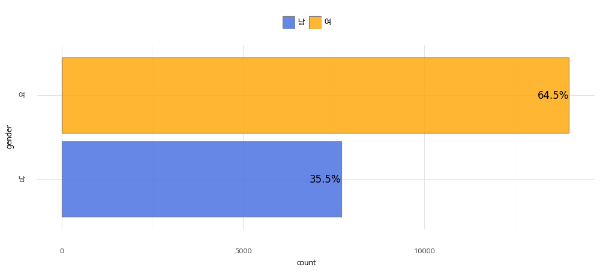
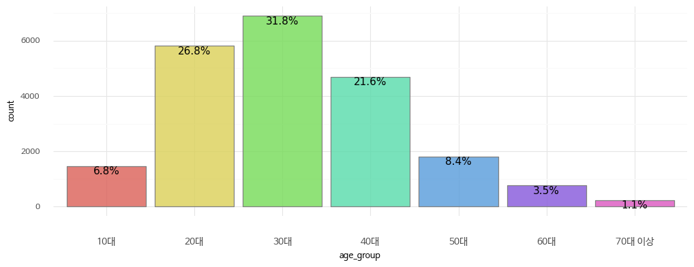
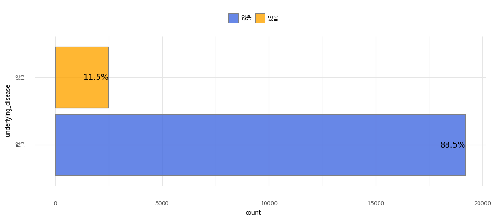
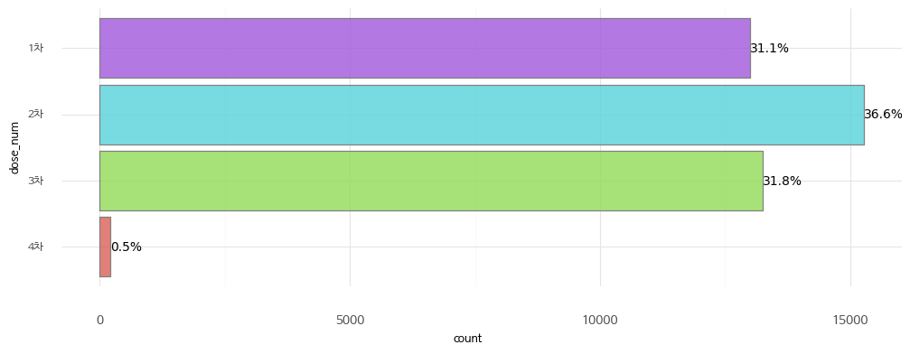
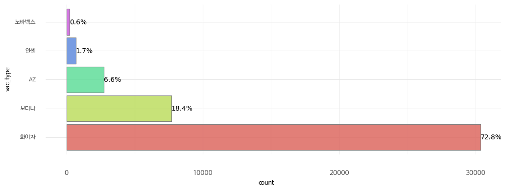
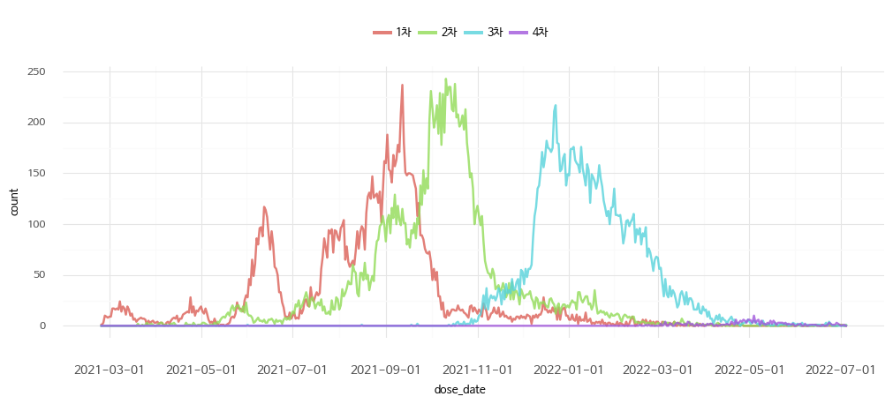

We have anonymized some of the COVID-19 vaccination records and post-vaccination adverse reaction data collected from the SHINE mobile app for research purposes.

#### Features

* The vaccine records uploaded to SHINE are voluntary records. A user may have completed both the first and second doses of the vaccine, but only record the second dose in the app.
* The vaccine records of SHINE users are data that have been confirmed by uploading proof of vaccination.

#### Information for variables

It has 21,693 rows and 39 columns, and the columns contain information of the following four types.

1\. User Information

| Column Name | Description | Example |
|-------|-----|-----|
| age_group | Age group | 30 |
| gender | Gender | Male |

2\. Underlying Disease Information

| Column Name | Description | Example |
|-------|-----|-----|
| underlying_disease | Presence of underlying disease | Yes |

3\. Vaccination Information

| Column Name | Description | Example |
|-------|-----|-----|
| dose_1_date | First dose date | 2021-01-21 |
| dose_1_type | First dose vaccine type | AZ |
| dose_2_date | Second dose date | 2021-02-22 |
| dose_2_type | Second dose vaccine type | 화이자 |
| dose_3_date | Third dose date | 2021-03-23 |
| dose_3_type | Third dose vaccine type | 얀센 |
| dose_4_date | Fourth dose date | 2021-04-24 |
| dose_4_type | Fourth dose vaccine type | 모더나 |

Unentered information by the user is marked with a dash (-).

4\. Symptom Information

Information about symptoms that appeared after each dose of the vaccine.

| Column Name | Description | Example |
|-------|-----|-----|
| dose_1_post_allegy | First dose allergic reaction | 1`4 |
| dose_1_post_fatigue |First dose fatigue | 1 |
| dose_1_post_fever | First dose fever | 1 |
| dose_1_post_inject_pain | First dose injection site pain | 1 |
| dose_1_post_inject_swell | First dose injection site swelling | 2 |
| dose_1_post_pain | First dose pain (excluding injection site) | 2`3 |
| dose_1_post_vomit | First dose vomiting | 3 |
| dose_2_post_allegy | Second dose allergic reaction | 1`4 |
| dose_2_post_fatigue | Second dose fatigue | 1 |
| dose_2_post_fever | Second dose fever | 1 |
| dose_2_post_inject_pain | Second dose injection site pain | 1 |
| dose_2_post_inject_swell | Second dose injection site swelling | 2 |
| dose_2_post_pain | Second dose pain (excluding injection site) | 2`3 |
| dose_2_post_vomit | Second dose vomiting | 3 |
| dose_3_post_allegy | Third dose allergic reaction | 1`4 |
| dose_3_post_fatigue | Third dose fatigue | 1 |
| dose_3_post_fever | Third dose fever | 1 |
| dose_3_post_inject_pain | Third dose injection site pain | 1 |
| dose_3_post_inject_swell | Third dose injection site swelling | 2 |
| dose_3_post_pain | Third dose pain (excluding injection site) | 2`3 |
| dose_3_post_vomit | Third dose vomiting	| 3 |
| dose_4_post_allegy | Fourth dose allergic reaction | 1`4 |
| dose_4_post_fatigue | Fourth dose fatigue | 1 |
| dose_4_post_fever | Fourth dose fever | 1 |
| dose_4_post_inject_pain | Fourth dose injection site pain | 1 |
| dose_4_post_inject_swell | Fourth dose injection site swelling | 2 |
| dose_4_post_pain | Fourth dose pain (excluding injection site) | 2`3 |
| dose_4_post_vomit | Fourth dose vomiting | 3 |

#### Basic Information of the Data

##### User Information

1\. Gender Distribution

2\. Age Distribution

Age groups are represented by numbers. For example, 20 means ages 20-29. The exception is that 10 represents ages 14-19 and 70 represents all ages 70 and over.

##### Underlying Disease Information

\* Underlying conditions: diabetes, hypertension, chronic cardiovascular disease, chronic cerebrovascular disease, neuromuscular disorders, chronic obstructive pulmonary disease, asthma, chronic lung disease, chronic kidney disease, dialysis, chronic liver disease, cancer, blood cancer, bone marrow transplant, organ transplant, autoimmune/rheumatic diseases, immunosuppressive drug administration.

##### Vaccination Information

1\. Distribution by dose

2\. Distribution by vaccine type

3\. Distribution by vaccination date

##### Symptom Information

1\. Allergic reaction

| Value | Description |
|-------|-----|
| 0 | None |
| 1 | Rash |
| 2 | Hives |
| 3 | Itching |
| 4 | Swelling of the face or lips |
| - | Not entered |

\* Multiple selections are separated by **\`**

2\. Fatigue

| Value | Description |
|-------|-----|
| 0 | No symptoms |
| 1 | Symptoms present |
| - | Not entered |

3\. Fever

| Value | Description |
|-------|-----|
| 0 | No symptoms |
| 1 | Symptoms present |
| - | Not entered |

4\. Injection site pain

| Value | Description |
|-------|-----|
| 0 | No symptoms |
| 1 | Symptoms present, but not severe enough to require medication |
| 2 | Pain severe enough to require medication for 1-2 days, no impairment in arm movement |
| 3 | Pain persists for 3 or more days, or pain is not controlled even with medication |
| - | Not entered |

5\. Injection site swelling

| Value | Description |
|-------|-----|
| 0 | No symptoms |
| 1 | Diameter less than 5cm |
| 2 | 5-10cm (uncomfortable to move) |
| 3 | More than 10cm, difficult to perform activities |
| 4 | Abscess formation |
| - | Not entered |

6\. Pain (outside the injection site)

| Value | Description |
|-------|-----|
| 0 | No symptoms |
| 1 | Headache |
| 2 | Joint pain |
| 3 | Muscle pain |
| - | Not entered |

\* Multiple selections are separated by **\`**

7\. Nausea

| Value | Description |
|-------|-----|
| 0 | No symptoms |
| 1 | Nausea present, but not uncomfortable enough to interfere with daily life |
| 2 | Occurs 1-2 times a day |
| 3 | Occurs more than 3 times a day |
| - | Not entered |
