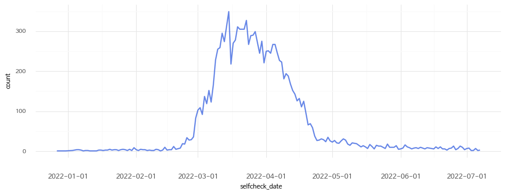

_**All data is based on voluntary records from SHINE app users and does not guarantee accuracy; responsibility for the use of this data lies with the user.**_

#### Features

* This is the self-check data for COVID-19 collected from the SHINE mobile app. It includes information entered by SHINE app users during self-checks, as well as COVID-19 PCR test results and records of COVID-19 vaccination. This is the data that has been anonymized from the collected data.
* There was no limit to the number of times you can use self-check and PCR test results records in the mobile app. Therefore, each user may have multiple self-check data sets, and the data published includes the input data from the self-check date closest to the PCR test date within 7 days before and after the PCR test.

#### Information for variables

It has 12,656 rows and 21 columns, and the columns contain information of the following five types.

1\. User Information

| Column Name | Description | Example |
|-------|-----|-----|
| age_group | Age group | 30 |
| gender | Gender | M |

2\. Health status Information

| Column Name | Description | Example |
|-------|-----|-----|
| underlying_disease | Presence of underlying disease | Y |
| smoking | Smoking status | N |

3\. covid-19 Test Information

| Column Name | Description | Example |
|-------|-----|-----|
| pcr_date | COVID-19 PCR Test Date | 2022-03-02 |
| pcr_result | COVID-19 PCR Test Result | P |

4\. Vaccination Information

| Column Name | Description | Example |
|-------|-----|-----|
| dose_1_date | First dose date | 2021-01-21 |
| dose_1_type | First dose vaccine type | AZ |
| dose_2_date | Second dose date | 2021-02-22 |
| dose_2_type | Second dose vaccine type | Pfizer |
| dose_3_date | Third dose date | 2021-03-23 |
| dose_3_type | Third dose vaccine type | Janssen |
| dose_4_date | Fourth dose date | 2021-04-24 |
| dose_4_type | Fourth dose vaccine type | Moderna |

Unentered information by the user is marked with a dash (-).

5\. Symptom Information

| Column Name | Description | Example |
|-------|-----|-----|
| selfcheck_date | Self check Date | 2022-02-10 |
| fever | Fever status | Y |
| fever_temp | Body temperature | 38 |
| fever_period | Duration of Fever | 3D |
| symptom | Type of symptoms occurred | 2`3 |
| group_infection_area | Visit to outbreak area | V |
| selfcheck_reason | Reason for Self-check | 1`5 |

#### Basic Information of the Data

##### User Information

1\. Gender

| Value | Description |
|-------|-----|
| M | Male |
| F | Female |

2\. Age group

Age groups are represented by numbers. For example, 20 means ages 20-29. The exception is that 10 represents ages 14-19 and 70 represents all ages 70 and over.

##### Underlying Disease Information

1\. Underlying Disease

| Value | Description |
|-------|-----|
| Y | Underlying disease present |
| N | No underlying disease |

\* Underlying conditions: diabetes, hypertension, chronic cardiovascular disease, chronic cerebrovascular disease, neuromuscular disorders, chronic obstructive pulmonary disease, asthma, chronic lung disease, chronic kidney disease, dialysis, chronic liver disease, cancer, blood cancer, bone marrow transplant, organ transplant, autoimmune/rheumatic diseases, immunosuppressive drug administration.

2\. Smoking

### COVID-19 Test Information

1\. PCR Test Result

| Value | Description |
|-------|-----|
| P | Positive |
| N | Negative |

2\. PCR Test result by date

##### Vaccination Information

1\. Vaccination date

2\. Vaccination by dose

3\. Vaccine type

| Value | Description |
|-------|-----|
| Pfizer | Pfizer |
| Moderna | Moderna |
| AZ | AstraZeneca |
| Novavax | Novavax |
| Janssen | Janssen |

##### Symptom Information

1\. Self-check date

2\. Fever status

| Value | Description |
|-------|-----|
| Y | Has fever |
| N | No fever |

3\. Body Temperature

\* Distribution of values excluding 0 (unanswered)

| Value | Description |
|-------|-----|
| 0 | Not entered |
| Numeric value | body temperature |

\* The fever temperature is a value manually entered by the user.

4\. Duration of fever

| Value | Description |
|-------|-----|
| N | Not entered |
| 1D | 1 day |
| 2D | 2 day |
| 3D | 3 day |
| 4D | 4 day |

5\. Types of symptoms

| Value | Description |
|-------|-----|
| 0 | No symptoms |
| 1 | Cough |
| 2 | Chest pain |
| 3 | Muscle pain |
| 4 | Eye redness |
| 5 | Fatigue |
| 6 | Headache |
| 7 | Dry cough |
| 8 | Body rash |
| 9 | Loss of taste |
| 10 | Constipation |
| 11 | Diarrhea |
| 12 | Shortness of breath |
| 13 | Chills |
| 14 | Sore throat |
| 15 | Loss of appetite |
| 16 | Blisters around the lips |
| 17 | Lips turning blue |
| 18 | Sneezing |
| 19 | Runny nose |
| 20 | Coughing up blood |
| 21 | Loss of smell |
| 22 | Other |

Separated by **\`** for multiple selections.

6\. Whether visited outbreak area

| Value | Description |
|-------|-----|
| NV | Not visited |
| V | Visited |
| DK | Don't know |

7\. Reason for Self-check

| Value | Description |
|-------|-----|
| 1 | One's own judgment |
| 2 | Self-quarantine |
| 3 | Before self-quarantine release |
| 4 | Symptomatic |
| 5 | Contact with public health center or emergency alert message |
| 6 | Overseas traveler |
| 7 | Preemptive testing |
| 8 | Close contact with a confirmed case |
| 9 | Contact with a person who entered from overseas |
| 10 | Visited area of outbreak |
