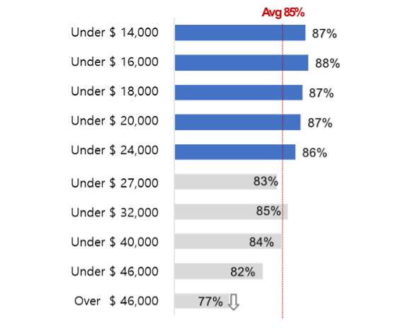

For the past three years, we've been trying hard to avoid getting COVID-19. We've tried to figure out who's at risk and where, and we've covered our faces with masks and sanitized our hands when we meet someone outside of our homes. Then one day, various people around us got COVID-19 and didn't show up for a week. I also endured for a long time, but I was infected at an unexpected moment, and I thought, "It's about time to get caught."

Then I saw a media report that low-income and vulnerable people were slower to recover after COVID-19. The socially disadvantaged were more vulnerable to recovery from the pandemic. I wondered if there would be social groups that are vulnerable to infection rather than recovery. Being vulnerable to infection has a different impact than being slow to recover. If there is a group of people who are vulnerable to infection and their social impact is high, it is a matter to be seriously examined.

With this motivation and the help of various organizations, we started the study of ‘Demographic and Sociological Characteristics of Vulnerable Groups of Infectious Diseases.’ We analyzed who is more at risk and who gets caught when it is about time to get caught from the perspective of social characteristics rather than individual health characteristics.

### Research Method

We analyzed whether there are differences in the risk of COVID-19 infection based on population and sociodemographic characteristics. In order to do this, both individual sociodemographic profile information and COVID-19 infection information are required. The information we collected through the mobile surveillance app includes individuals' basic demographic characteristics (gender, age, etc.) and COVID-19 infection information. However, since we could not obtain the desired results with the information we have, we decided to combine our information with information from other institutions.

We pseudonymized the SHINE data and collaborated with Korean government agencies (NIA: National Information Society Agency) to combine it with the pseudonymized data from the credit rating agency (NICE Credit Information). Then, we analyzed the differences in infection rates according to sociodemographic characteristics using the combined data* and made inferences about the causes.

> ***Description of the data used in the research**: PCR test result, gender, age range, presence of underlying diseases, type of residence, occupational classification, credit information, and income level of 15,001 users who entered their PCR test results for COVID-19 on the SHINE app from January to April 2022.

### High sociodemographic risk factors for COVID-19 infection

The sociodemographic factors that are highly correlated with the risk of COVID-19 infection are in order of occupational group, age, income, and credit score**. _Figure 1_ shows the difference in COVID-19 infection rates by occupational group.

> ***Methodology for calculating the impact of each characteristic on COVID-19 infection**:
> - Created a decision tree model for predicting COVID-19 infection using sociodemographic characteristics that showed statistically significant differences in COVID-19 infection rates as independent variables
> - Calculated the relative influence (feature importance) of each variable in the generated decision tree model on predicting COVID-19 infection

<figure>
  
  <figcaption>Figure 1. COVID-19 infection rate by occupation categories</figcaption>
</figure>

The COVID-19 infection rate was higher in service industries that involve frequent face-to-face contact. The industry with the highest infection rate was the arts, sports, and leisure services, which involve prolonged interaction with others in enclosed spaces. It was found that workers in environments generally known to have a higher risk of COVID-19 infection. In addition, occupations that involve indoor activities, such as accommodation and food service, transportation, and personal services, also showed a higher infection rate as a high-risk occupation for COVID-19.

On the other hand, industries related to facilities such as electricity, gas, water supply, and sewage had a low COVID-19 infection rate. The result reflected the transmission characteristics of respiratory infectious diseases such as COVID-19. One notable point is that the health care industry (hospitals) and social welfare services, which are industries with many face-to-face interactions, had a low COVID-19 infection rate. It is believed that this reflects the strict adherence to infection prevention rules and the strengthened government control and prevention measures in these industries.

### High demographic risk factors for COVID-19 infection

Looking at the status of the COVID-19 infection rate by gender and age, as announced by the KDCA, the infection rate for women and the younger population is relatively higher, as shown in _Figure 2_ The same result was also observed in the SHINE data, where it was found that the infection rate for women between their teens to their 50s was higher.

<figure>
  
  <figcaption><em>1) Korea census (2020)</em></figcaption> 
  <figcaption><em>2) Korea CDC (26, Jan. 2023) (https://ncov.kdca.go.kr)</em></figcaption> 
  <figcaption>Figure 2. COVID-19 Infection rates by Gender, Age group in Korea</figcaption>
</figure>

<figure>
  
  <figcaption>Figure 3. COVID-19 Infection rates by Gender, Age group in SHINE (Jan – Apr. 2022)</figcaption>
</figure>

Then, what would be the reason for the higher infection rate among women and younger age groups? 

First, let's look at why the infection rate is higher among the younger age group. The younger age group tends to have more social activities than the older age group, such as school and work. As a result, the younger age group has more opportunities for face-to-face contact, which may explain why they have a higher infection rate than the older age group. It can be estimated that the spread of COVID-19 occurs through the initial infection of the younger age group with high social activities, followed by the infection of the older age group. _Figure 4_ shows a graph that categorizes COVID-19 patients by age group during the large-scale outbreak of COVID-19 in early 2022.

<figure>
  
  <figcaption>Figure 4. Weekly trend of COVID-19 infection rates by Age group in Korea (Jan – Jun. 2022, Ministry of Health and Welfare)</figcaption>
</figure>

The graph above in _Figure 4_ shows the number of confirmed cases by age group on a weekly basis, and the graph below shows the proportion of confirmed cases by age group on a weekly basis. At the beginning of the spread, the infection rate was higher in the age groups of teens and 20s than in other age groups, but as the spread progressed, the infection rate decreased. On the other hand, those aged 60 and above, although having a smaller proportion of the total confirmed cases during the period when the number of cases was relatively low, had a higher proportion of the total confirmed cases as the spread continued. This could be interpreted as a result of the fact that COVID-19 first spread among the younger age groups. However, there were significant differences in third dose vaccination rates among age groups during this period*. Since not getting vaccinated against COVID-19 is not the direct cause of infection, given the characteristics of infectious diseases that are transmitted to others, it is reasonable to attribute the results to the combination of extensive social activities and low vaccination rates. In the age groups excluding those in their 10s, 20s, and those aged 60 and above, there was not a significant difference in the proportion of confirmed cases throughout the entire period shown in the above graph, which lets us know that factors other than vaccination rates are at play in creating such differences.

Additionally, at the end of each wave of the pandemic, the proportion of young people increases and that of older people decreases in the total number of confirmed cases. This is because as the COVID-19 pandemic subsides, the spread pattern shifts from a nationwide epidemic to a local epidemic, similar to the early stages of the outbreak.

> ***The third dose vaccination rates by age group announced by the KDCA on January 24, 2022 were as follows**: 8% for 10s, 32.9% for 20s, 36.0% for 30s, 41.2% for 40s, 64.3% for 50s, and over 80% for aged 60 and above.

### Are economically vulnerable groups at higher risk of infection?

It would be possible to reach a conclusion on this question by aggregating the analysis results discussed earlier. Service occupations, women, and young people are relatively low-income groups*. Therefore, it can be inferred that the infection rates are higher among these groups, so it is possible to speculate that economically vulnerable groups will have higher infection rates. Let's look at whether actual data supports this conclusion.

<figure>
  
  <figcaption>Figure 5. COVID-19 infection rates by annual income group (SHINE)</figcaption>
</figure>

When income was divided into 10 groups, those in the 5th income group and below had a higher infection rate than the average, while those in the 6th income group and above had a lower infection rate than the average. The result shows that the group with lower income is relatively more vulnerable to COVID-19 infections. However, the important point to note from this data is not that the infection rate is only 1-2% higher for those in the 5th income group and below than the average, but that the infection rate for those in the top 10th income group is significantly lower than the average. Therefore, analyzing the factors that make the infection rate lower for those in the top income group and seeking ways to reduce the infection risk for other groups would be the appropriate conclusion.

The factors discussed earlier were analyzed indirectly through the wage distribution data by occupation provided by the Ministry of Employment and Labor. It was difficult to conduct a significant analysis by combining income and occupation due to the small sample size. According to the data provided by the Ministry of Employment and Labor, when dividing occupations into eight major categories, the wage levels are shown in Table. 14. The 10th percentile of income corresponds to the wage of managers and professionals, including related workers. Broadly speaking, office workers have a lower COVID-19 infection rate than other occupations. Managers and office workers are likely to have limited contact with the population during their work, which may reduce their exposure to COVID-19 in close proximity to an unspecified number of people.

Based on the analysis of income by company size, it can be inferred that individuals working in companies with 500 or more employees have a lower risk of COVID-19 infection, as the average income increases with larger company size. Since the outbreak of COVID-19, many companies have implemented policies such as working from home to ensure the safety of their employees. These policies have mainly been implemented in companies with a focus on office work and larger company sizes, which may have contributed to reducing the risk of COVID-19 infection in higher-income groups.

| Job classifications                               | Annual wage (avg.) | Annual wage(median) |
| :------------------------------------------------ | :-----------------: | :------------------: |
| 1 Manager                                         | 144,107            | 114,547             |
| 2 Professionals and allied workers                | 59,817             | 47,218              |
| 3 Office workers                                  | 57,600             | 46,426              |
| 4 Sales people                                    | 48,253             | 39,045              |
| 5 Technicians and related functional workers      | 44,691             | 39,108              |
| 6 Device, Machine Operators, and Assembly Workers | 43,015             | 36,776              |
| 7 Service workers                                 | 29,797             | 26,659              |
| 8 Manual laborers                                 | 29,312             | 26,817              |
 
| Company size           | Annual wage (avg.) | Annual wage(median) |
| :--------------------- | :-----------------: | :------------------: |
| 1    5 to 29 people    | 45,050             | 34,760              |
| 2    30 to 99 people   | 46,589             | 37,729              |
| 3    100 to 299 people | 51,042             | 41,474              |
| 4    300 to 499 people | 59,054             | 49,769              |
| 5    over 500 people   | 79,155             | 71,012              |

| Gender      | Annual wage (avg.) | Annual wage(median) |
| :---------- | :-----------------: | :------------------: |
| 1    Male   | 59,020             | 47,243              |
| 2    Female | 40,982             | 31,907              |

<figcaption><em>Monetary unit: KRW</em></figcaption>
<figcaption>Wage distribution by business characteristics data from the Ministry of Employment and Labor (Jun. 2022)</figcaption>

### Conclusions and thoughts

Through analyzing several sociodemographic factors and COVID-19 infection rates, we have identified groups that are more vulnerable to COVID-19 infection. Service industry workers, women, and young people have been shown to have a higher risk of COVID-19 infection compared to other groups. In particular, young people had a relatively high infection rate during the early stages of COVID-19 spread. In addition, the group with the highest income had a relatively low COVID-19 infection rate, which is thought to be due to the working environment of high-income earners.

Combining the sociodemographic characteristics that are at high risk of COVID-19 infection, we can conclude that they are "groups with high likelihood of contact with others". Both occupation, age, and income are groups that have a high likelihood of contact with others, and therefore, are at high risk for COVID-19. This is a rather obvious conclusion considering the characteristics of infectious diseases. However, the fact that this phenomenon has occurred based on the characteristics of infectious diseases makes us to think about whether there were any shortcomings in our response to infectious diseases.

We usually assume that elderly people and people with underlying health conditions as COVID-19 high-risk groups from a medical and public health perspective because they have a higher risk of severe illness if infected. However, what if we also define high-risk groups from a social perspective? The high-risk groups we analyzed from a sociodemographic perspective are more likely to have close contact with others, which could lead to a large outbreak of the disease. Moreover, if these groups become infected, the work disruption caused by their infection has an impact on maintaining social function. We hope that the results of our research could be used to minimize the blind spots where Social High-risk Groups are located, in the urgent medical situation that could occur in the next pandemic.
